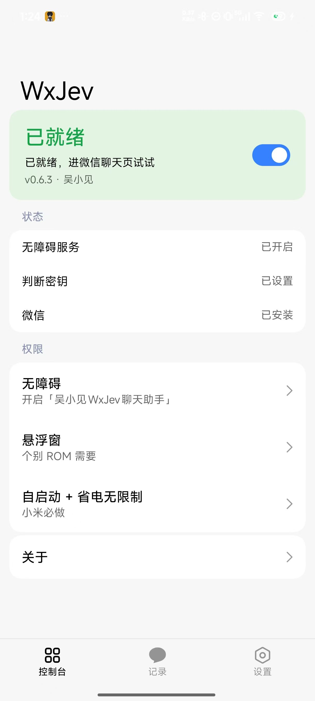
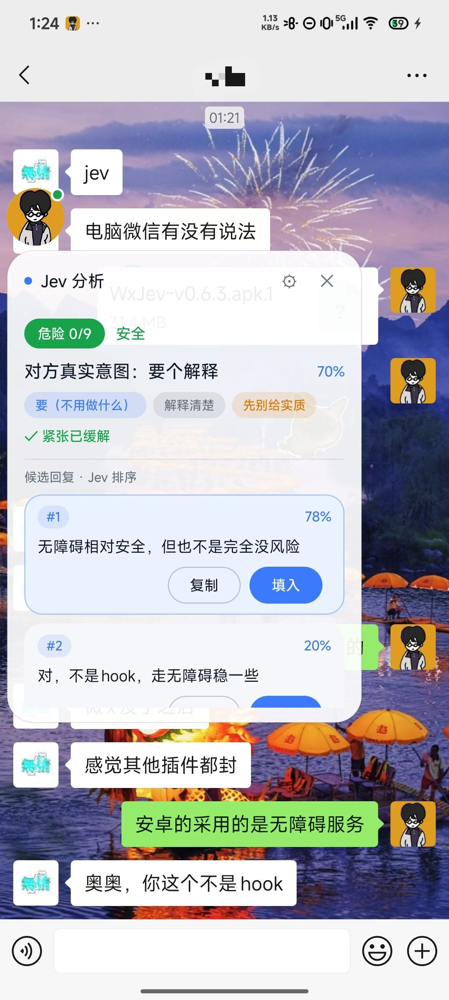
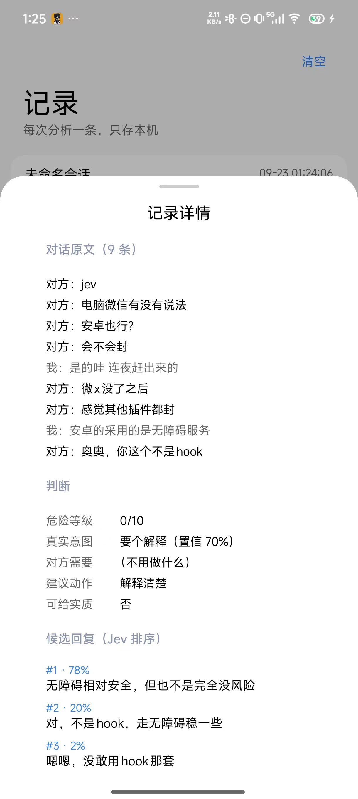

# WxJev 吴小见

Jev聊天助手的 Android 独立实现（无障碍路线）：免 root、免注入的普通 App，系统无障碍服务「旁挂」读取聊天页 → Jev 双路分析 → 悬浮面板 → 一键回填输入框，**发送永远手动**。

App 显示名「吴小见」，包名 `com.eatmans.wxjev`，当前版本 **v0.6.3**（Compose + miuix UI）。伪装链路已通过小米 15 真机可读性验证（PASS-A）；路线与里程碑见 [docs/开发计划书.md](docs/开发计划书.md)。

## 截图

| 控制台 | 聊天页悬浮面板 | 记录详情 |
|:---:|:---:|:---:|
|  |  |  |

## 工作原理

1. **采集**：无障碍服务以伪装类名（系统 `SelectToSpeakService` 全名）注册，绕过微信 8.0.52+ 对普通无障碍服务的节点混淆；各 App 适配器解析气泡得到「谁说的/说了什么」，白名单过滤、去重、防抖。
2. **分析**：判断路 7 道判断题（意图/风险/概率/最佳动作）+ 回复路由 OpenAI 兼容端点起草 3 条候选并排序；两路地址/密钥/模型独立配置，改完下一次调用即生效。
3. **面板与回填**：悬浮球 + 展开面板（`TYPE_ACCESSIBILITY_OVERLAY` 优先，悬浮窗权限兜底）；点「填入」经 `ACTION_SET_TEXT` 写入输入框（失败退剪贴板 + `ACTION_PASTE`），**绝不自动发送**。
4. **触发**：默认手动点悬浮球；「自动分析」默认关、有每日上限（50），需在控制台自行开启。

已适配：微信 8.0.52+（伪装读取）、手机 QQ、X（Twitter）私信；飞书等正文自绘 App 走 OCR 兜底（规划 M5，未实现）。

## 构建

JDK 21 + Android SDK（compileSdk 37，AGP 9.4.1 / Kotlin 2.4.20 / Gradle 9.6.1，wrapper 自带）。minSdk 30（Android 11+）。仓库已配国内 Maven 镜像。

```bash
./gradlew assembleDebug   # app/build/outputs/apk/debug/app-debug.apk
```

## 使用（真机）

1. 安装 APK → 打开 App → 按引导开启无障碍服务「**吴小见WxJev聊天助手**」。
2. 设置页配置判断/回复两路接口（任意 OpenAI 兼容 `/chat/completions` 端点）与关系描述。
3. 停在聊天页，点悬浮球 → 查看分析与候选回复 → 点「填入」→ 手动点发送。
4. MIUI/HyperOS：给 App 开自启动 + 省电策略无限制；前台保活已内置，若仍被冻结，切回 App 一次即恢复。
5. P1 探针阶段的验收记录见 [docs/P1真机验收清单.md](docs/P1真机验收清单.md)（探针已随 PASS-A 裁撤，正式版只保留伪装服务）。

## 红线

不 hook、不注入、不改微信包、不读微信数据库；只读采集（唯一写动作是用户点「填入」的回填）；绝不自动发送；不碰转账/红包/收款；聊天内容仅在分析那一刻发给模型接口，不落盘不进日志；密钥仅存本机 App 私有目录，不进日志不进 git。

## 致谢

- [Jev聊天助手（jev-chat/jev-chat-jarvis）](https://github.com/jev-chat/jev-chat-jarvis)：本项目参考了其聊天内容采集与 OCR 实现，以及解决微信对普通无障碍服务无法识别节点问题的思路（服务伪装成系统 SelectToSpeakService）。该仓库以 MIT 协议开源。
